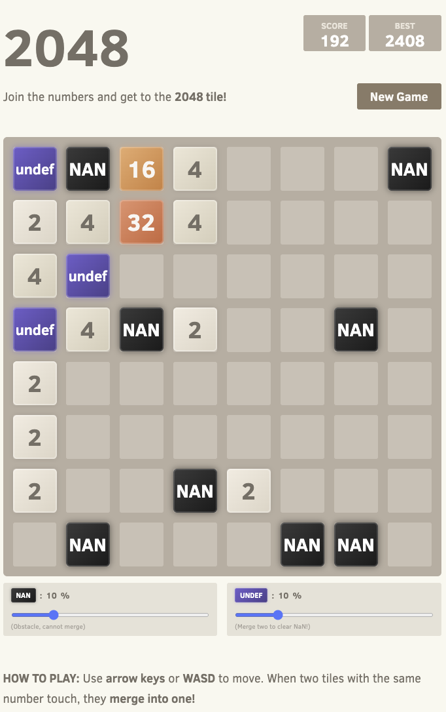

# Crazy 2048

A chaotic twist on the classic 2048 puzzle game — featuring an **8×8 board** and special tiles that add strategic depth.



## Features

- **8×8 Grid** — More space, more chaos
- **NaN Tiles** — Immovable obstacles that block your path
- **Undefined Tiles** — Merge two to clear ALL NaN tiles from the board
- **Adjustable Difficulty** — Control spawn rates with sliders (0-50%)
- **Local Save** — Game state persists in your browser

## How to Play

| Control | Action |
|---------|--------|
| `↑ ↓ ← →` | Move tiles |
| `W A S D` | Move tiles |

**Goal:** Combine tiles to reach **2048** (or beyond!)

**Strategy tip:** When NaN tiles block you, merge two `undefined` tiles to clear them all at once.

## Run Locally

```bash
# Just open the file
open index.html

# Or use any static server
npx serve .
```

## Tech Stack

Pure HTML/CSS/JavaScript — no frameworks, no build step required.

## License

MIT
